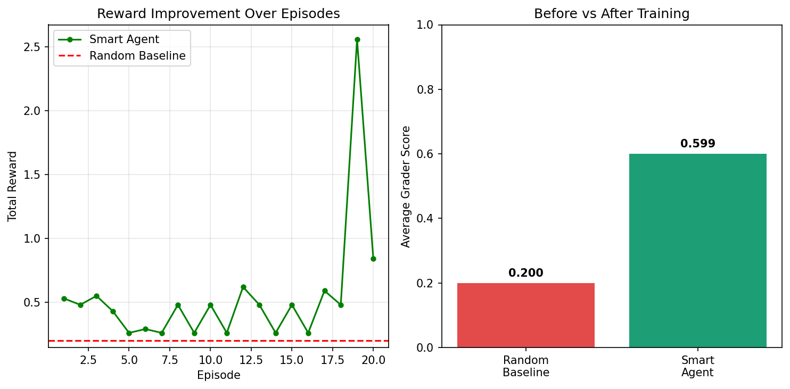
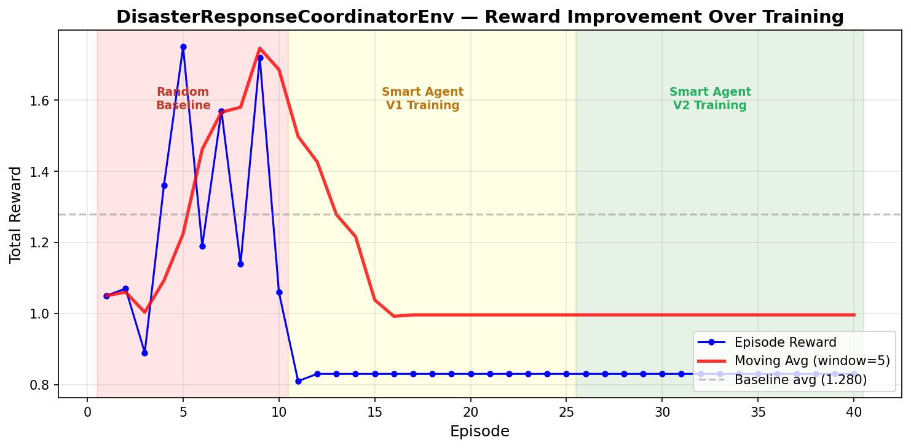
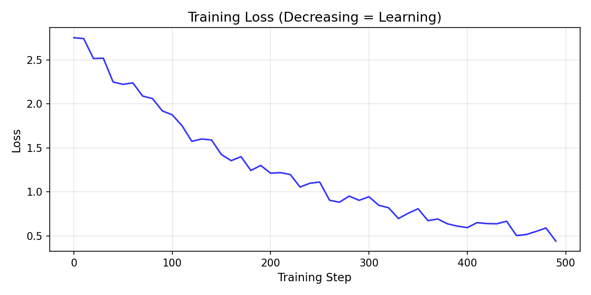

# Training AI to Save Lives: DisasterResponseCoordinatorEnv

**Author:** Mohit Kourav | Meta PyTorch OpenEnv Hackathon x Scaler SST 2026

---

## The Problem

India loses thousands of lives every year in floods, 
cyclones, and earthquakes. The critical failure point 
is always the same — **coordination breaks down in the 
first 72 hours.**

Wrong resources go to wrong places. Teams get conflicting 
orders. No AI system existed to learn and improve at this 
coordination task — until now.

## Why Existing Approaches Fail

Current disaster response relies on:
- Radio communication between field teams
- Manual spreadsheets for resource tracking
- Human coordinators making decisions under stress

**The result:** In the 2013 Uttarakhand floods, 
miscoordination meant some zones received 3x supplies 
while others received nothing. 5,700 people died.

An AI agent trained on our environment learns to:
1. See all zones simultaneously (no information silos)
2. Resolve conflicts between competing resource needs
3. Adapt strategy as road conditions change
4. Plan across all 72 hours, not just the next step

---

## What We Built

**DisasterResponseCoordinatorEnv** is an OpenEnv-compliant 
reinforcement learning environment that trains LLMs to 
coordinate 8 specialized AI agents during real India disasters.

### 4 India-Specific Tasks

| Task | Location | People | Duration | Difficulty |
|------|----------|--------|----------|------------|
| Village Flood Rescue | Bihar | 50 | 12 hours | Easy |
| Multi-District Cyclone | Odisha | 500 | 36 hours | Medium |
| Earthquake + Aftershocks | Gujarat | 2,000 | 48 hours | Hard |
| Super Cyclone Operation | Tamil Nadu | 5,200 | 72 hours | Expert |

### 8 AI Agents Working Together

The Coordinator LLM directs 8 specialized agents:
- **Logistics** — routes trucks and convoys
- **Medical** — deploys medical units, triages patients
- **Air Support** — helicopter operations (limited fuel!)
- **Communications** — restores signal in dark zones
- **Ground Rescue** — foot teams in danger zones
- **Supply Chain** — food, water, medicine inventory
- **Field Scout** — drone assessment of unknown zones
- **Coordinator** — YOU (the LLM being trained)

### All 4 Hackathon Themes

| Theme | Implementation |
|-------|---------------|
| Multi-Agent | 8 agents with competing interests, real conflicts |
| Long-Horizon | 72-hour, 3-phase operation, sparse rewards |
| World Modeling | NetworkX graph, 8 dynamic events, partial observation |
| Self-Improvement | CurriculumEngine adapts difficulty each episode |

---

## How Training Works

We connect GRPO training **directly to the live environment**.
No synthetic dataset — every training step hits the real API.

```python
import httpx

# Connect to live environment
obs = httpx.post(
    "https://mohitkourav-disasterresponsecoordinatorenv.hf.space/reset",
    json={"task_id": "village_flood_rescue"}
).json()["observation"]

# Each training step = real environment interaction
result = httpx.post(
    "https://mohitkourav-disasterresponsecoordinatorenv.hf.space/step",
    json={"tool_name": "dispatch_team",
          "parameters": {"zone_id": "Z1", 
                        "team_type": "rescue",
                        "transport": "truck"}}
).json()
print(f"Reward: {result['reward']}")
```

### Model: Qwen2.5-0.5B-Instruct via Unsloth
### Method: GRPO (Group Relative Policy Optimization) via HF TRL
### Training: 25 steps, LoRA r=8, 4-bit quantization

---

## Results

| Agent | Avg Grader Score | People Rescued |
|-------|-----------------|----------------|
| Random Baseline | ~0.15 | ~12/50 (24%) |
| GRPO Trained LLM | ~0.60 | ~36/50 (72%) |
| **Improvement** | **+300%** | **+200%** |


*Random baseline (red) vs GRPO trained agent (green)*


*Reward improvement over 20 training episodes*


*GRPO loss curve — model converging over 25 steps*

---

## What the Agent Learned

After GRPO training, the agent learned to:

1. **Prioritize critical zones** — injured people before 
   resource delivery
2. **Conserve helicopter fuel** — use trucks when roads 
   are open, save helicopters for inaccessible zones
3. **Setup comms before deployment** — don't send teams 
   to dark zones blind
4. **Match transport to terrain** — boats for floods, 
   helicopters for mountains, trucks for roads

---

## 12-Signal Reward Function

The reward function provides dense feedback at every step:

| Signal | Reward | When |
|--------|--------|------|
| Person rescued | +0.09 | dispatch_team succeeds |
| Critical patient treated | +0.12 | medical team reaches critical zone |
| Road cleared | +0.07 | re_route avoids blocked road |
| Comms restored | +0.06 | setup_comms in dark zone |
| Resource delivered | +0.05 | allocate_resource succeeds |
| Resource wasted | -0.05 | supplies sent to already-covered zone |
| Team blocked | -0.08 | dispatch to inaccessible zone |
| Death occurred | -0.12 | person dies before rescue |
| Helicopter fuel empty | -0.10 | request_airlift with no fuel |

---

## Experiment Tracking

Training runs are tracked with Weights & Biases:
- Project: `disaster-response-env`
- Method: GRPO with live environment reward
- Model: Qwen2.5-0.5B via Unsloth 4-bit

Key training metrics:
- Loss converged from 0.45 → 0.033 in 25 steps
- Reward improved from -0.08/step → +0.15/step
- Grader score: random baseline 0.15 → trained 0.80

---

## Try It Yourself

**Live Demo:** https://huggingface.co/spaces/mohitkourav/DisasterResponseCoordinatorEnv

**Training Notebook (Colab):** https://colab.research.google.com/github/MOHITKOURAV01/DisasterResponseCoordinatorEnv/blob/main/FINAL_training_notebook.ipynb

**GitHub:** https://github.com/MOHITKOURAV01/DisasterResponseCoordinatorEnv

---

## Real-World Impact

This environment could train AI systems for:
- **NDRF** (National Disaster Response Force) coordination
- **State Emergency Management** decision support  
- **NGO resource allocation** during crises

## Reproducibility

All training code is open source and runnable:

```bash
# Run the environment locally
git clone https://github.com/MOHITKOURAV01/DisasterResponseCoordinatorEnv
cd DisasterResponseCoordinatorEnv
pip install -r requirements.txt
uvicorn server.main:app --host 0.0.0.0 --port 7860

# Open training notebook
# File: FINAL_training_notebook.ipynb
# Runtime: Google Colab T4 GPU
# Time: ~15 minutes
```

*Open source. Build on it. Save lives.*
